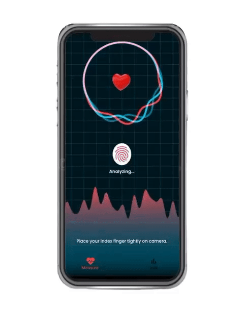
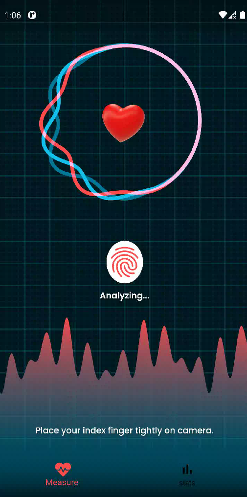
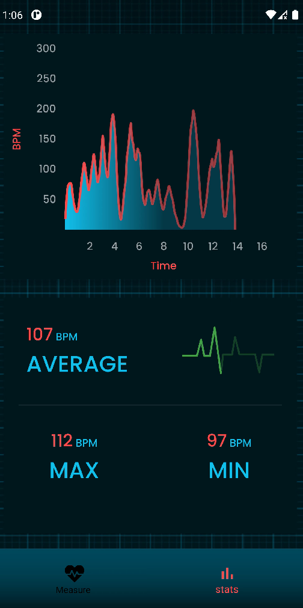

# **Flutter Heart Rate Monitor :heartpulse:** 

A simple Flutter app to estimate heart beats per minute. The data estimated in the app uses [**Heart Rate API**](https://heart-rate-07.herokuapp.com/) which is complety free to use.

Check following repository to know more about [**Heart-Rate-Api**](https://github.com/7-USH/Heart-Rate-API).

## **Demo**

## **Requirements**
- Any Operating System (i.e. MacOS X, Linux, Window)
- Any IDE with Flutter SDK installed (i.e. IntelliJ, Android Studio, VSCode etc)
- Knowledge about Dart and Flutter

## **Features**

- [x] Estimate BPM
- [x] Heart rate statistics 

## **Plugins**

Name | Usage
---|---
[**font_awesome_flutter**](https://pub.dev/packages/font_awesome_flutter) | Awesome icons
[**flutter_sinusoidals**](https://pub.dev/packages/flutter_sinusoidals) | Sine wave generator
[**fl_chart**](https://pub.dev/packages/fl_chart) | Line char diagram
[**camera**](https://pub.dev/packages/camera) | Capture ppg data
[**lottie**](https://pub.dev/packages/lottie) | Animated gifs
[**firebase_storage**](https://pub.dev/packages/firebase_storage) | Store video recording

## **Screenshots**

Homepage | Statistics
---|---
 | 

## **License**

[GNU General Public License v3.0](https://github.com/7-USH/Heart-Rate-Monitor/blob/master/LICENSE)
